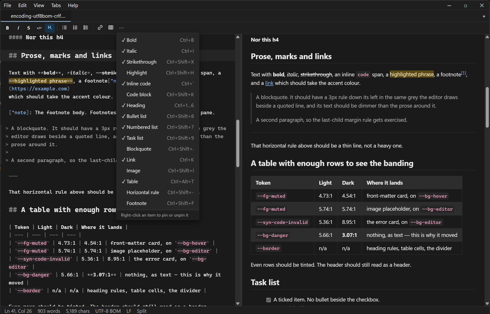
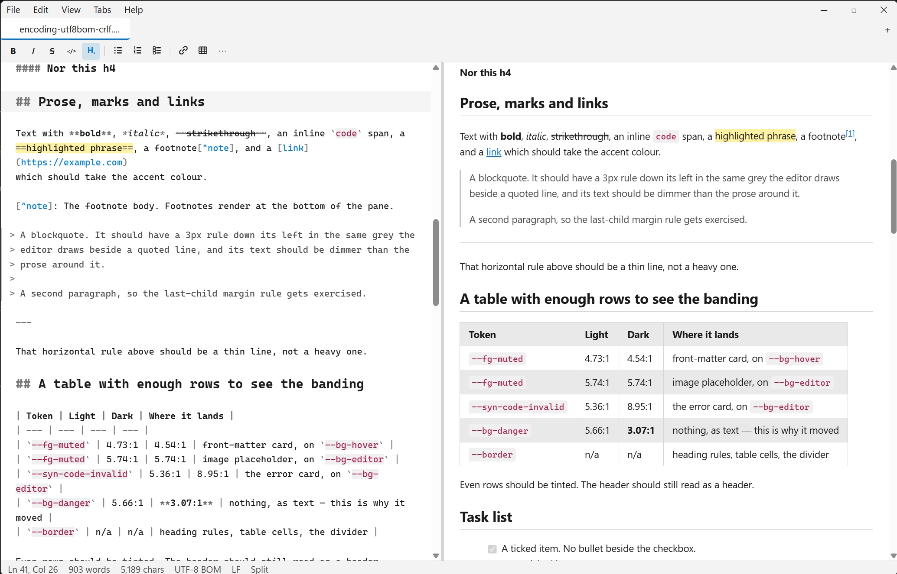

# Hashpad

**Notepad, but for markdown.**

A lightweight markdown editor for Windows. It opens instantly, keeps to itself,
and does not ask you to sign in to anything.



---

## Why

Most markdown editors fail in at least one of the same few ways: they ship a
browser to render a text file, they put the features behind a subscription, they
sync to a cloud nobody asked for, they phone home, or the interface is involved
enough to be a second thing to learn.

Hashpad is the boring alternative. The design rule throughout: *if a feature
would make a first-time user stop and wonder what it does, it belongs in a menu,
not on the screen.*

**It makes no network requests of any kind.** Not for updates, not for
telemetry, not for fonts. The Content Security Policy that enforces this omits
remote origins entirely, so a remote image in a document renders as a muted
placeholder showing its URL rather than being fetched. This is a structural
property of the build, not a setting that can be toggled on by accident.

---

## Features

**Editing** — CodeMirror 6 with markdown syntax highlighting, sixteen formatting
commands with keyboard shortcuts, find and replace, a document outline, word
wrap, and zoom.

**Preview** — a live pane rendered by markdown-it and sanitised by DOMPurify,
with scroll synchronisation, GitHub-flavoured styling that follows the active
theme, and fenced code highlighted by the same parsers the editor uses.

**Tabs** — open, close, reopen a closed tab, reorder by dragging, middle-click
to close. One tab per file: opening a file that is already open switches to it.

**Files** — UTF-8, UTF-8 with BOM and UTF-16LE are detected on open and
preserved on save. CRLF and LF are detected, preserved, and never silently
converted. Both are shown in the status bar. Drag files onto the window to open
them; drag or paste images to add them to the document.

**Appearance** — light and dark themes that follow the Windows setting, an
accent colour picker, and configurable fonts and sizes for the interface, the
editor and the preview independently.

**Saving** — the classic model. Closing a modified tab prompts Save / Don't Save
/ Cancel; quitting prompts once per modified tab. Nothing is cached to disk
behind your back. Autosave exists, is off by default, and never creates a file
that does not already exist.

<table>
<tr>
<td width="50%"></td>
<td width="50%"></td>
</tr>
<tr>
<td align="center"><em>Light</em></td>
<td align="center"><em>Dark</em></td>
</tr>
</table>

---

## Installing

Two downloads. Both are the same application.

| | What it does |
|---|---|
| **`Hashpad.exe`** (portable) | Runs from anywhere. Creates its `settings.json` beside itself on first launch and writes nothing else outside its own folder. Give it its own directory and it leaves no trace on the machine. |
| **`Hashpad-amd64-installer.exe`** | Installs to Program Files or to your user profile — it asks which. Adds a Start Menu entry, and *offers* to associate `.md`, `.markdown`, `.mdown` and `.mkd`. The association is a checkbox, never forced, and the uninstaller asks before removing your settings. |

Windows 10 or 11. The WebView2 runtime is required and is already present on
current Windows installations; the installer will fetch it if it is missing.

### On the SmartScreen warning

The first time you run either download, Windows will show a blue
**"Windows protected your PC"** dialog, and you will have to click *More info →
Run anyway*.

This is not a virus warning. SmartScreen keeps a reputation score for every
executable, keyed on its exact contents, and an application that has not been
downloaded by many people yet has no reputation to check. The way to remove the
warning is a code-signing certificate, which costs a few hundred dollars a year
and which this project does not have. Every new release resets the score, so a
signed build is the only real fix, not patience.

---

## Building from source

Requires [Go](https://go.dev/) 1.24+, [Node.js](https://nodejs.org/) 20+, and
the [Wails v2 CLI](https://wails.io/docs/gettingstarted/installation).

```bash
git clone https://github.com/<your-account>/Hashpad.git
cd Hashpad
wails build
```

The result lands in `build/bin/`. To build the portable variant, which differs
only in that it seeds its own settings file:

```bash
wails build -ldflags "-X hashpad/internal/app.portableBuild=true"
```

Running the test suites:

```bash
go test ./...
cd frontend && npm install && npm test
```

---

## How it is put together

Go owns the filesystem and the operating system. The frontend owns everything to
do with markdown. There is exactly one markdown parser in the project, in the
frontend, so the editor and the preview cannot disagree about what a document
means.

```
main.go              Window, single-instance lock, command-line files
internal/app/        Files, encodings, settings, image handling, asset serving
internal/platform/   The Windows-specific surface, isolated behind an interface
frontend/src/        Editor, preview, commands, UI, state
docs/design.md       Every design decision, and every deviation from the spec
docs/testing.md      The manual checks automated tests cannot reach
SPEC.md              The requirements this was built against
```

Built with [Wails v2](https://wails.io/), [CodeMirror 6](https://codemirror.net/),
[markdown-it](https://github.com/markdown-it/markdown-it) and
[DOMPurify](https://github.com/cure53/DOMPurify).

**Current state:** 12.7 MB executable, 1,388 automated tests, no known defects.

---

## On how this was built

**Hashpad was written entirely by an AI — every line of it — and the point of
saying so is that this is not the disclaimer it usually is.**

"Vibe coding" normally means describing what you want, accepting whatever comes
back, and finding out later what it actually does. That is not what happened
here, and the difference is a process rather than a prompt:

- **A specification came first.** [`SPEC.md`](SPEC.md) was written before any
  code and fixed what the application had to do, what it must never do, and the
  budgets it had to fit inside. It was the reference for every decision that
  followed, not a description written afterwards.

- **Work went in phases, each stopping for a human to actually run it.** Nine of
  them. Several defects that no test could have caught — a preview pane that
  forgot it was open, clipped icons, a caret landing in the wrong place — were
  found exactly this way and fixed before the next phase started.

- **Every new test was verified by breaking the thing it tested.** A test that
  cannot fail is worse than no test, because it reports safety that is not
  there. Each one was checked by deliberately corrupting the behaviour it covers
  and confirming it went red. This routinely found tests that passed against
  both the correct implementation and a broken one, and it found several
  *guards* that could not fail either — code that read as protection while
  something upstream already guaranteed the condition. Those were deleted rather
  than kept for comfort.

- **Claims were measured, not asserted.** Contrast ratios were sampled from
  rendered pixels rather than computed from the stylesheet. Memory was measured
  across the whole process tree, and when the result missed the target, the miss
  was written down — see [`docs/design.md`](docs/design.md) §4.21 — rather than
  quietly restated as a different target.

- **Every departure from the specification is recorded with its reasoning.**
  Twenty-five of them, in [`docs/design.md`](docs/design.md) §4, including the
  ones where the specification turned out to be wrong and the ones where an idea
  was investigated and rejected.

The honest summary: the AI wrote the code, and the discipline around it — a
written spec, adversarial review of every change, tests proven capable of
failing, and numbers instead of adjectives — is what makes the result worth
trusting. The process is the interesting part. The code is just markdown editor
code.

---

## Licence

MIT. See [`LICENSE`](LICENSE).
