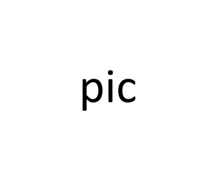
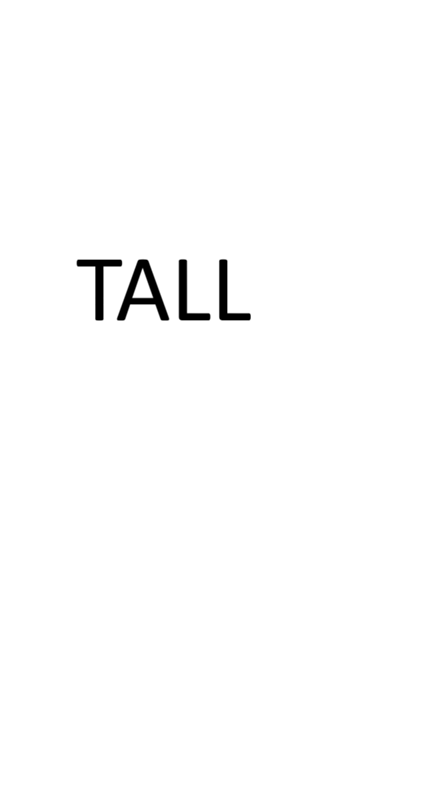

---
title: Preview check fixture
author: Checkpoint F
tags: preview, styling, manual checks
this line has no colon so it should span the whole card
---

# Preview check fixture

The document that `docs/testing.md`'s Checkpoint F manual checks ask for. **Copy
this file somewhere outside the repo before opening it** — the local-image check
needs an image beside it, and the Save As check moves it to a different folder.

Two things to do first:

1. Drop any PNG or JPG next to this file and rename it `pic.png`. Nothing here
   can ship a binary, so the local-image reference below is broken until you do.
2. Put a **second** image beside it named `tall.png`, and make it genuinely tall
   — at least 800px, several times the height of a line of text. This is not
   decoration: the scroll-sync check below is the whole reason the sync is
   line-anchored rather than proportional (design §4.17), and that only shows up
   when one source line occupies several hundred rendered pixels. Pointing it at
   the same small `pic.png` makes the check pass while proving nothing.
3. Copy `pic.png` again as `my pic.png` — the spaced name is what exercises the
   asset route's percent-encoding.
4. Open the preview with **Ctrl+Shift+P**.

The front matter above is deliberately awkward: four key/value rows plus one line
with no colon, which is both a real thing people write and the shape malformed
YAML takes. It should render as one dimmed card, with the colonless line spanning
the full width rather than squeezed into the key column.

## Headings, and which ones get a rule

Only `h1` and `h2` carry a bottom border. This `h2` should have one.

### This h3 must not have a rule

#### Nor this h4

## Prose, marks and links

Text with **bold**, *italic*, ~~strikethrough~~, an inline `code` span, a
==highlighted phrase==, a footnote[^note], and a [link](https://example.com)
which should take the accent colour.

[^note]: The footnote body. Footnotes render at the bottom of the pane.

> A blockquote. It should have a 3px rule down its left in the same grey the
> editor draws beside a quoted line, and its text should be dimmer than the
> prose around it.
>
> A second paragraph, so the last-child margin rule gets exercised.

---

That horizontal rule above should be a thin line, not a heavy one.

## A table with enough rows to see the banding

| Token | Light | Dark | Where it lands |
| --- | --- | --- | --- |
| `--fg-muted` | 4.73:1 | 4.54:1 | front-matter card, on `--bg-hover` |
| `--fg-muted` | 5.74:1 | 5.74:1 | image placeholder, on `--bg-editor` |
| `--syn-code-invalid` | 5.36:1 | 8.95:1 | the error card, on `--bg-editor` |
| `--bg-danger` | 5.66:1 | **3.07:1** | nothing, as text — this is why it moved |
| `--border` | n/a | n/a | heading rules, table cells, the divider |

Even rows should be tinted. The header should still read as a header.

## Task list

- [x] A ticked item. No bullet beside the checkbox.
- [ ] An unticked item.
- [ ] Clicking either checkbox must do nothing — the preview renders the
      document, it does not edit it.
- A plain list item in the same list, which *should* keep its bullet.

## Fenced code

The colours here must match what the editor shows for the same lines. A fence may
render unhighlighted for one frame and then recolour; that is expected.

```js
const s = 'string';
// a comment
function f(x) {
  return x + 1;
}
```

```python
def greet(name):  # a comment
    return f"hello {name}"
```

```diff
@@ -1,2 +1,2 @@
-removed line
+added line
```

A fence with a very long line, to check that it scrolls the block and not the
whole pane:

```text
this line is deliberately far too long to fit in any reasonable preview pane width and should produce a horizontal scrollbar on the code block itself rather than on the pane
```

A fence in a language nothing loads, which should stay plain but stay escaped:

```brainfuck
+<not a script>+
```

## Images

A local image, which loads through the asset route once you have put `pic.png`
beside this file:



A remote image, which must show a dashed placeholder carrying its URL and must
not make a network request (SPEC §2.1):


An image with a spaced filename, for the Task 4 encoding check:


## Scroll sync

Everything below exists to make the rendered height diverge from the source
height, which is the whole reason sync is line-anchored rather than proportional
(design §4.17). Scroll the editor so a heading is at the top and confirm the same
heading is at the top of the preview — then the reverse.

### A tall image is one source line



### Padding to scroll through

Line 1 of filler.
Line 2 of filler.
Line 3 of filler.
Line 4 of filler.
Line 5 of filler.
Line 6 of filler.
Line 7 of filler.
Line 8 of filler.
Line 9 of filler.
Line 10 of filler.

### The last heading

Put the caret here, scroll to it in each pane, and confirm the other follows.

<!-- This HTML comment must be visible in the editor and absent from the preview (SPEC §6.8). -->
